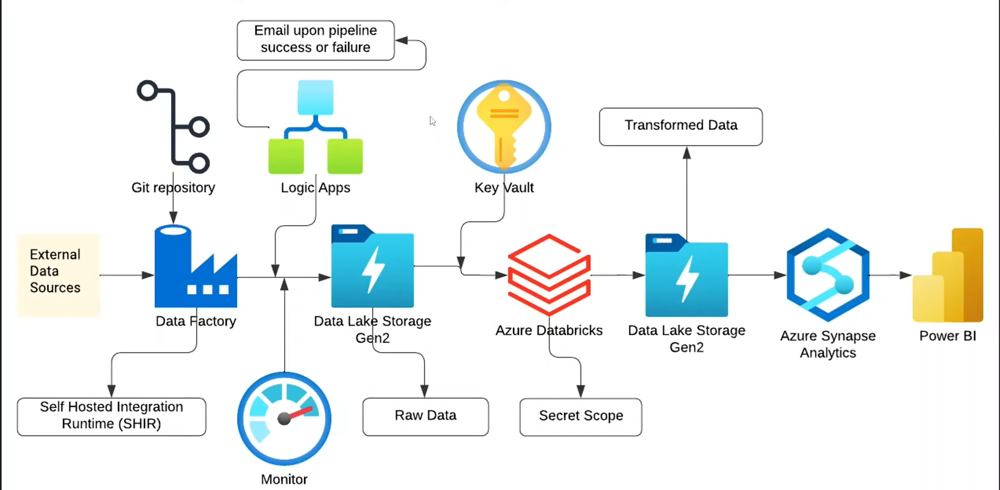

## 1. Project Explanation and Data Overview

### Project Purpose

This project outlines a **complete end-to-end Azure data engineering pipeline** that simulates a real-world scenario where data engineers move **on-premises data** to the Azure cloud, transform it, secure it, and then generate valuable business insights. This journey provides hands-on experience with multiple Azure services and demonstrates how these tools are integrated in enterprise-grade data management.

The diagram below illustrates the complete, end-to-end data flow and the integration of the Azure services used in this project. **The pipeline orchestrates data ingestion from a simulated local source (On-Premises), its transformation, security, and final delivery to Power BI.**

### Dataset Overview

The project uses the **CRM Sales Opportunities** dataset from Maven Analytics. This dataset provides the necessary complexity for practicing data cleaning and analytical querying.

The dataset comprises five core tables:

*   **`accounts`:** Contains data about companies, including their sector, established date, total revenue, number of employees, office location, and subsidiary information.
*   **`data_dictionary`:** A reference table that explains the meaning of column names in the other tables (e.g., defining `product` as containing the product names).
*   **`products`:** Lists the suggested sales price for each product.
*   **`sales_pipeline`:** The main transactional table, containing details like the sales agent, the product being sold, the deal stage (Engaging, Won, or Lost), the engage date, close date, and the closed value of the deal.
*   **`sales_teams`:** Contains the names of the sales agents, who their manager is, and their office location.

---

## 2. Technical Implementation and Architecture

### Technologies Used

The solution utilizes a modern cloud data stack:

*   **Orchestration & Data Movement:** Azure Data Factory (ADF).
*   **Data Lake Storage:** Azure Data Lake Gen 2 (ADLG2).
*   **Big Data Transformation:** Azure Databricks.
*   **Analytical Query Engine:** Azure Synapse Analytics.
*   **Security & Secrets Management:** Azure Key Vault.
*   **Pipeline Monitoring & Reliability:** Azure Logic Apps and Azure Monitor.
*   **Visualization & Reporting:** Power BI.
*   **On-Premises Connectivity:** Microsoft Integration Runtime (Self-Hosted IR).
*   **Version Control:** GitHub (integrated with ADF).

### Data Ingestion and Transfer

The pipeline is designed to securely bring data from a simulated on-premises location into Azure:

*   **Secure Bridge:** The **Self-Hosted Integration Runtime (SHIR)** is installed in the on-premises environment, acting as a secure gateway to allow Azure Data Factory to connect and transfer the data without public exposure.
*   **Orchestration:** Azure Data Factory executes the `onrem to cloud` pipeline, which includes **Copy Activities** to move the five tables.
*   **Version Control:** **Git integration (GitHub)** was enabled in ADF to store all pipeline definitions, ensuring version control for every change.
*   **Reliability:** **Azure Logic Apps** were configured to send email alerts whenever the pipeline succeeds or fails, ensuring the team is informed in real time. Additionally, **Azure Monitor** was set up for deeper system-wide pipeline tracking, providing dashboards, logs, and alerts.

### Storage and Security

The data lake was configured with enterprise best practices for storage and credential management:

*   **Data Lake:** **Azure Data Lake Gen 2 (ADLG2)**, enabled by setting the **Hierarchical Namespace**, serves as the central storage. It contains two containers: `raw data` (initial ingestion) and `transform data` (cleaned data).
*   **Secrets Management:** **Azure Key Vault** was used to store sensitive access keys. To access these keys securely from Databricks, a **Databricks Secret Scope** was created, ensuring actual credentials are never exposed in the code.
*   **Network Security:** Best practices, such as requiring **secure HTTPS transfer** and setting the **minimum TLS version to 1.2**, were implemented for the storage account.

### Transformation with Databricks

Data transformation was performed using large-scale compute:

*   **Tool:** **Azure Databricks** was used to leverage Apache Spark for data cleaning and preparation.
*   **Cleaning Logic:** The process involved mounting ADLG2 securely and implementing specific logic, such as:
    *   Renaming the "subsidiary of" column to a more understandable "parent company".
    *   Handling null values by filling 70 nulls in the `parent company` column with the value "independent".
    *   Filling null values in the `account` column of the sales pipeline with "unknown".
*   **Output:** The transformed and cleaned data was then written back to the ADLG2 `transform data` container.

### Analysis with Synapse

Azure Synapse Analytics was used to prepare the clean data for BI tools:

*   **Query Engine:** The **serverless SQL pool** in Azure Synapse Analytics was employed to query the large datasets efficiently.
*   **Methodology:** SQL **views** (e.g., `dbo.v_accounts`) were created over the files in the ADLG2 `transform data` container, allowing analysts to query the data using standard SQL.
*   **Security:** The Synapse workspace was configured to use **only Microsoft Entra ID authentication** for enhanced security.
*   **Example Insight:** Queries were run to identify the sales agent with the highest closed value.

### Visualization with Power BI

The final stage involved presenting the analytical results:

*   **Connection:** Power BI Desktop connected to the cleaned data residing in the ADLG2 `transform data` container.
*   **Reporting:** A professional report was developed, featuring interactive dashboards.
*   **Key Performance Indicators (KPIs):** The report highlighted critical business metrics, including Total Deals, Deals Won, Deals Lost, Total Sales by Agent, Revenue by Sector, and the **Win Rate Percentage**.
